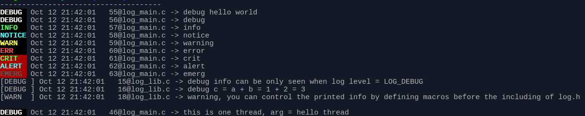

# LOG module

A preprocessor macro controlled log module.

# Introduction
Users are allowed to control all the details of log information with defining
appropriate macros.

# Setting Options

Here is a full list of macros:

```
#define LOG_DIS_COLOR
#define LOG_EN_STD_LEVEL_NUM

#define LOG_LEVEL LOG_INFO
#define LOG_STD_LEVEL LOG_ERR
#define LOG_FILE_LEVEL LOG_CRIT

#define LOG_EN_PREFIX_PID
#define LOG_EN_PREFIX_TID

#define LOG_DIS_FILE_PREFIX_TIME
#define LOG_DIS_FILE_PREFIX_FILE
#define LOG_DIS_FILE_PREFIX_LINE
#define LOG_DIS_FILE_PREFIX_LEVEL
#define LOG_DIS_FILE_PREFIX_PID
#define LOG_DIS_FILE_PREFIX_TID

#define LOG_DIS_STD_PREFIX_TIME
#define LOG_DIS_STD_PREFIX_FILE
#define LOG_DIS_STD_PREFIX_LINE
#define LOG_DIS_STD_PREFIX_LEVEL
#define LOG_DIS_STD_PREFIX_PID
#define LOG_DIS_STD_PREFIX_TID

#define LOG_DIS_PREFIX_TIME
#define LOG_DIS_PREFIX_FILE
#define LOG_DIS_PREFIX_LINE
#define LOG_DIS_PREFIX_LEVEL
#define LOG_DIS_PREFIX_PID
#define LOG_DIS_PREFIX_TID
```
# Default Behavior

By default, log to file function is disabled. Define `LOG_EN_FILE_LOG`
macro to enable file logging. It is better to define this macro globally,
due to the fact that this behavior affects each source files in your
project.

Another noticeable fact is that the thread implementation is variable.
In other word, besides `pthread` implementation, there exist some other
thread libraries, such as Apple's Grand Central Dispatch(GCD).If you
happen to use these libs. You should modify the `get_tid()` function.

Print **PID** and **TID** is disabled by default, most of time, they are
useless. But you can enable them anytime by defining `LOG_EN_PREFIX_PID`
and `LOG_EN_PREFIX_TID`.

# ScreenShots




